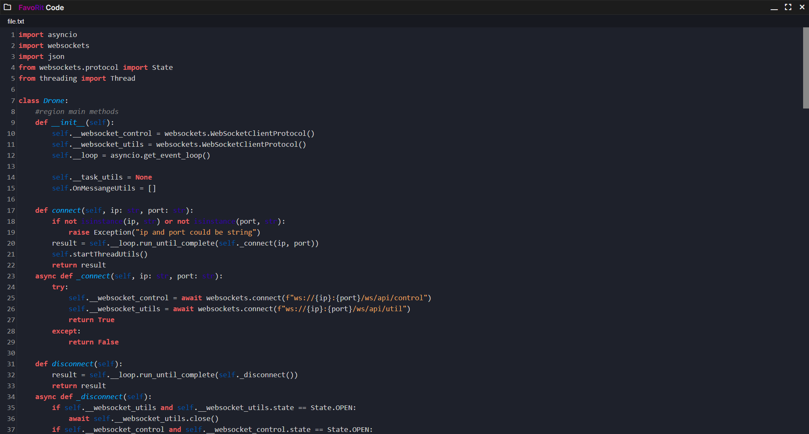

<p align="center"></p>
<h1 align="center">FavoRit Code</h1>

<div align="center">


[](#)
[](#)
[](#)

</div>

# Screenshot


# About the project
Favorit Code is a free source code editor. It boasts a design, functionality, and flexible customization. Favorit Code is written in JavaScript, CSS, HTML, and Python. 

# Download
```bash
# Clone repos
git clone https://github.com/filcherock/FavoRit-Code.git

# Go to the created directory
cd FavoRit-Code

# Establishing dependencies
npm install

# Start FavoRit Code
npm start
```

# License
FavoRit Code is licensed under the MIT License
